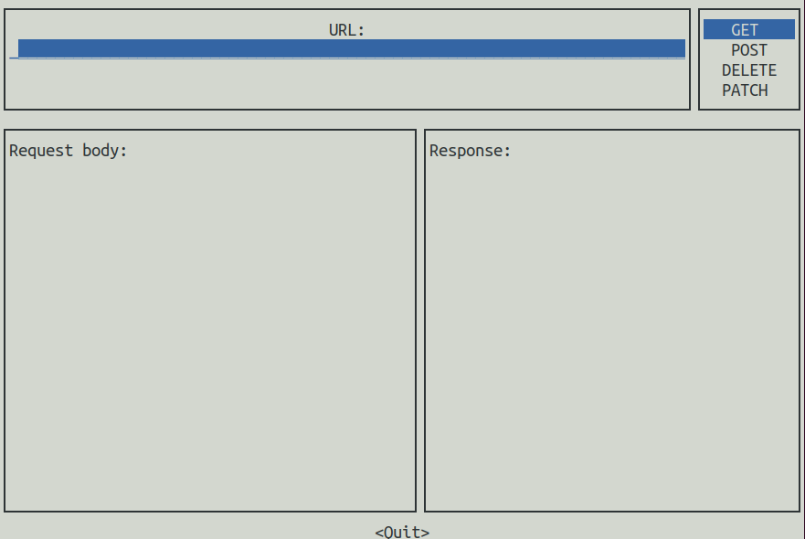

# Rust API Client

A command line app for interacting with web APIs, written in Rust.

-----

## Features

### Interactive mode

```bash
rust_api_client interactive
```

This will launch an interactive TUI prompt for sending requests*



### File mode

```bash
rust_api_client from-file <FILE>
```

This will send any number of requests, using the same client, based on the content of the specified file*. This file must be JSON, in the format specified below:

```json
{
    "requests": [
        {
            "url": "",
            "method": "",
            "body": ""
        },
        ...
    ]
}
```

Where...
- `url` is a required field whose value is the destination url
- `method` is a required field whose value is the HTTP request method and must be one of `GET`, `POST`, `PATCH`, or `DELETE`
- `body` is an optional field whose value is the request body

-----

*Additional options are available, run the `help` command on a mode to see these.